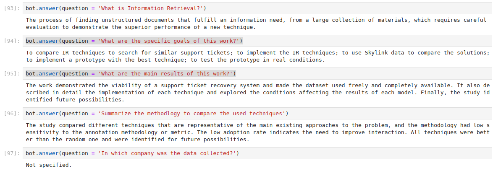
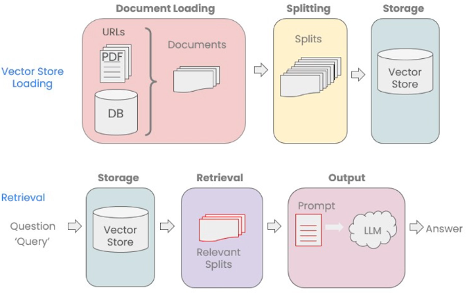

# Demo Retrieval Augmented Generation

Chatbot that answers questions about my own bachelor thesis (which was, ironically, about Information Retrieval).

I made available to the system the thesis itself (in pdf), the slides, plus some random annotations, and it successfully answer questions that one could only know by reading my thesis, like “what were the main results”. 

Screenshot (running inside a jupyter notebook):



Tech stack:

* LangChain (a framework for developing LLM-based applications)
* Azure OpenAI services 
* ChromaDB (a vector search database)

## What is Retrieval Augmented Generation (RAG)?

Large Language Models like ChatGPT can’t really know about private documents, internal knowledge bases, project documentation, etc; they only know the data they were trained with.
The technique of Retrieval Augmented Generation solves this by allowing an LLM-based software to first search for relevant entries in a corpus of private documents, then use them to compose the chat answer that will be returned to the user.
That is, “talking to your data” by enhancing the LLM chatting capabilities with your own private data, in a completely privacy-preserving and secure way.

The usual workflow is:



# Getting started with this demo

## Running the notebooks

Rename the file `notebooks/.env-template` to `notebooks/.env`, and include your OpenAI credentials.

Execute in a terminal, from the main folder of the repository:

```bash
docker-compose -f notebooks/docker-compose.yml up
```

and go to the address `http://127.0.0.1:8888?token=c61a728d-f4e6-45f0-9bb6-65646801f994`

## Adding your data

Save PDFs in the folder `data`

## Load data data, split, vectorize and store

Run the notebook `Step 1 - Vectorize and index documents.ipynb`.

## Read from store, ask question

Run the notebook `Step 2 - Chat.ipynb`
